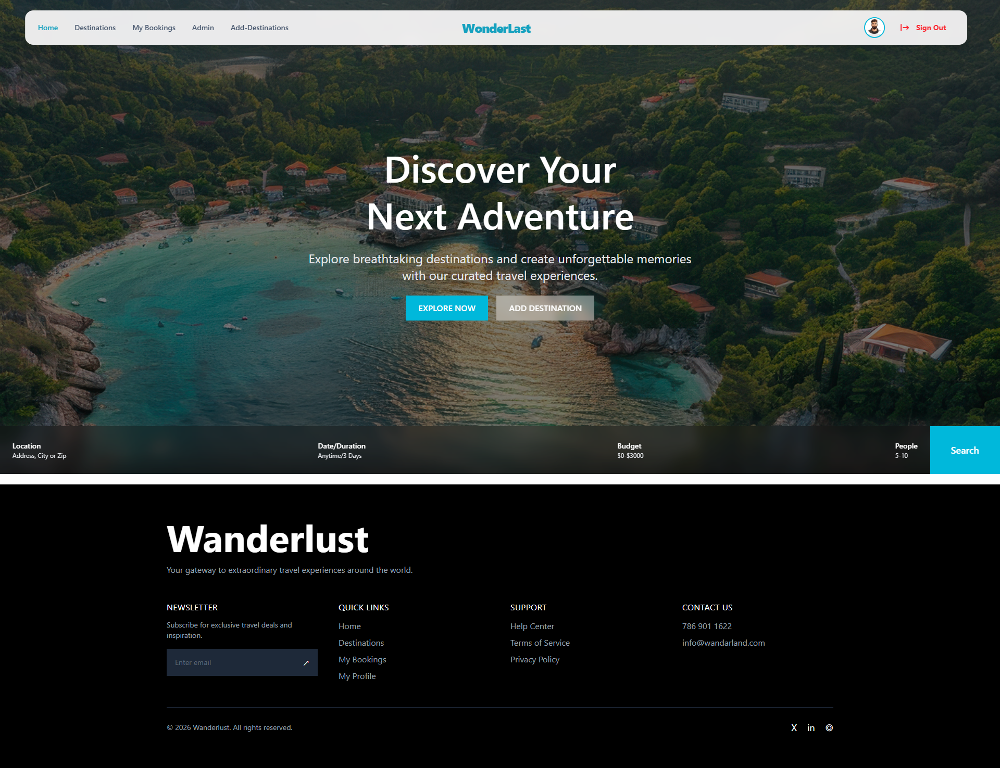
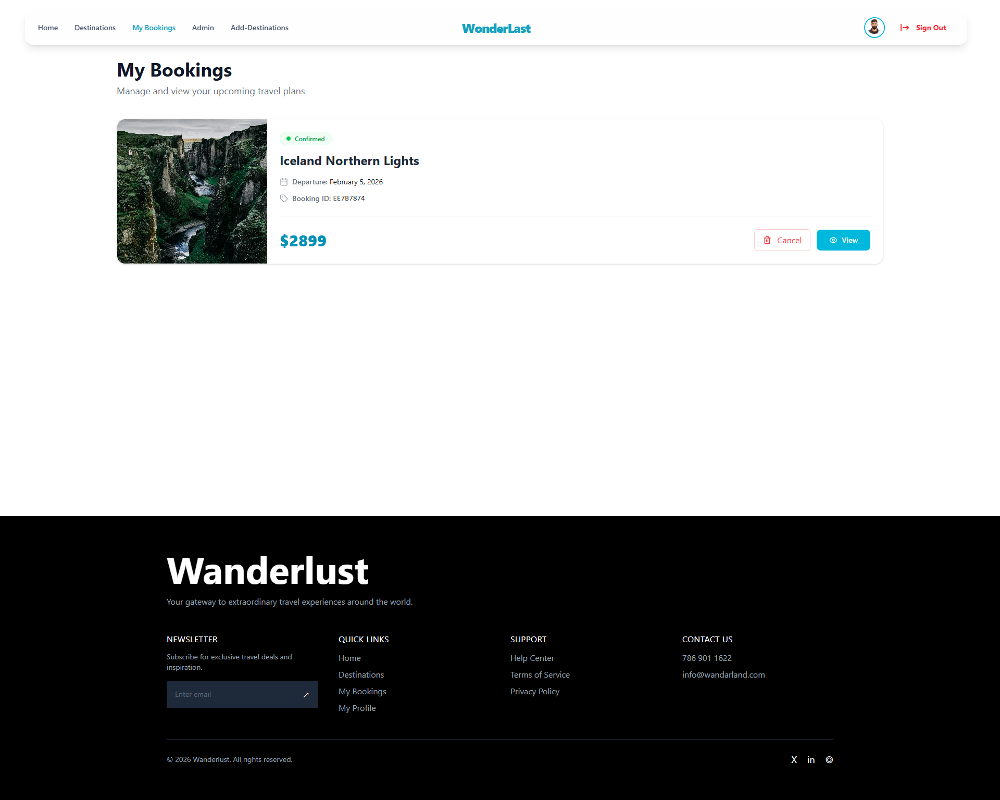
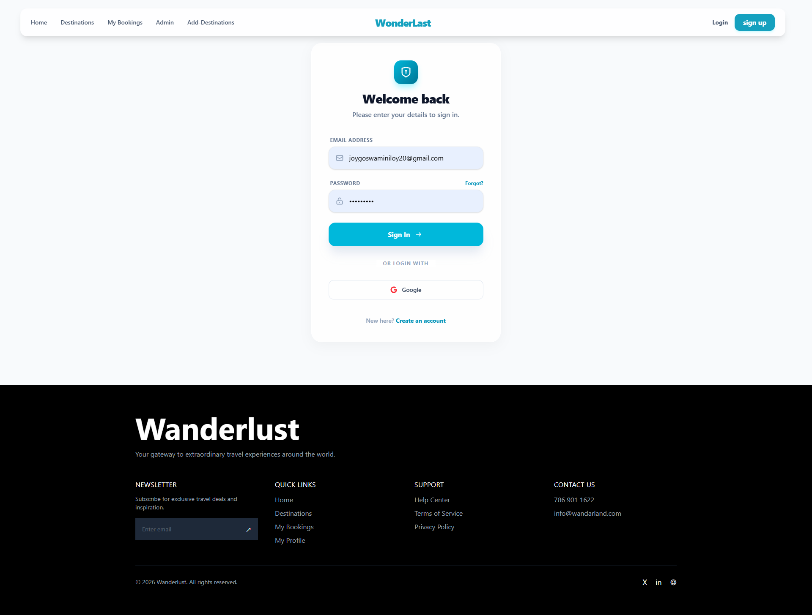
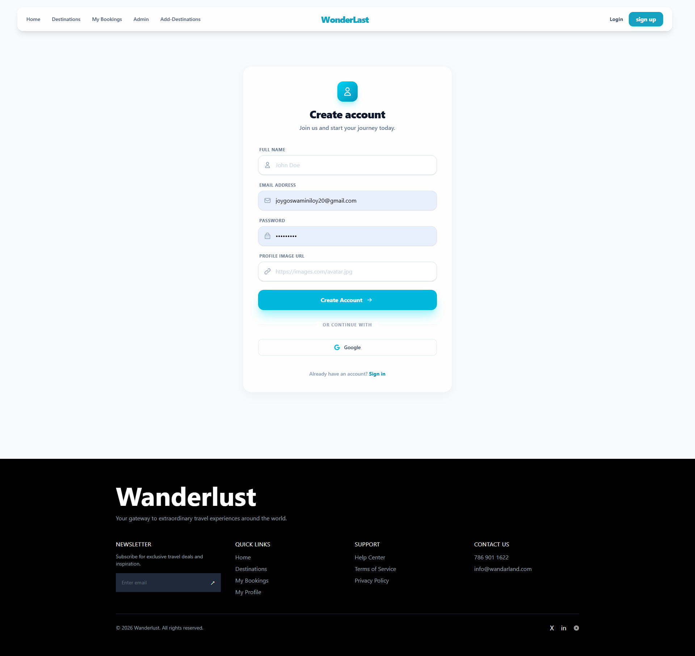
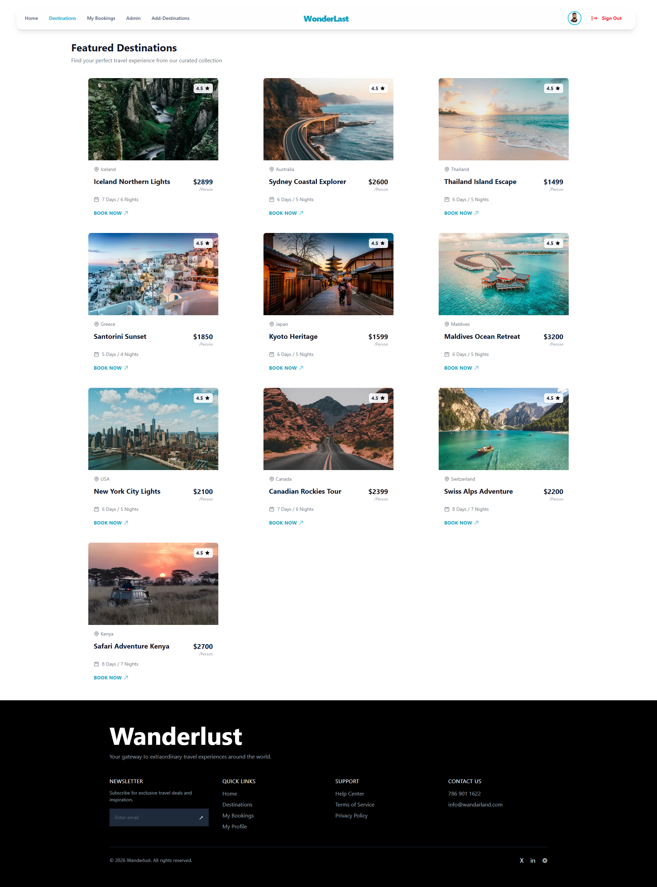
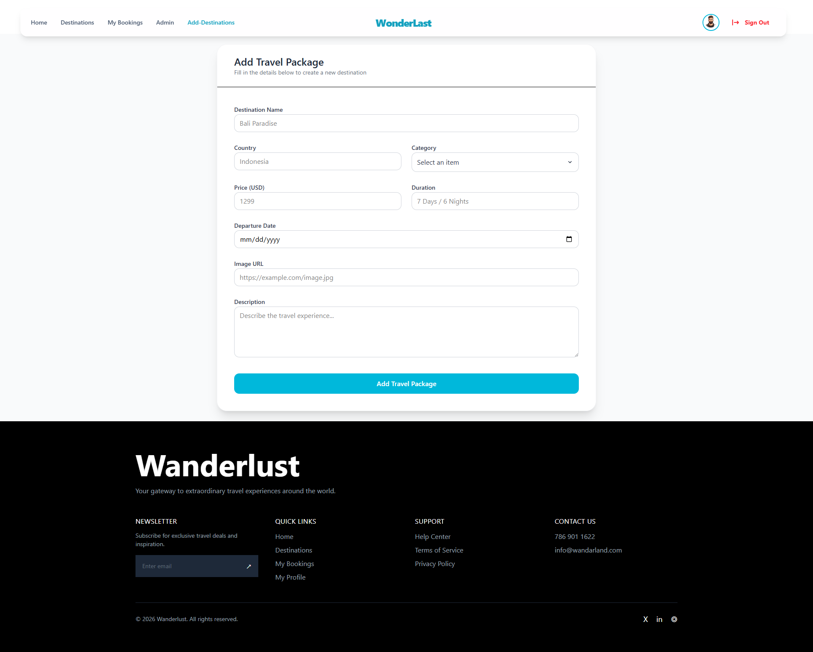

# 🌍 Travel Booking Platform

A modern, full-stack travel booking application built with **Next.js** and **Node.js**. This platform allows users to seamlessly discover travel packages, manage bookings, and features a robust admin dashboard for complete destination management.

---

## 🚀 Live Demo

🔗 [Explore the Travel Booking Platform Live](https://your-live-link.vercel.app)

---

## 📸 Screenshots

### Main Portal & User Experience
<table width="100%">
  <tr>
    <td width="50%" align="center">
      <h3>🏠 Home View</h3>
      
    </td>
    <td width="50%" align="center">
      <h3>📅 User Bookings</h3>
      
    </td>
  </tr>
</table>

### Access Control
<table width="100%">
  <tr>
    <td width="50%" align="center">
      <h3>🔑 Login Gate</h3>
      
    </td>
    <td width="50%" align="center">
      <h3>📝 Registration</h3>
      
    </td>
  </tr>
</table>

### Admin Dashboard & Management
<table width="100%">
  <tr>
    <td width="50%" align="center">
      <h3>🗺️ Destination Catalog</h3>
      
    </td>
    <td width="50%" align="center">
      <h3>➕ Add Destination</h3>
      
    </td>
  </tr>
</table>

---

## ✨ Key Features

* **📦 Package Discovery:** Dynamic routing to explore and filter unique travel destinations.
* **🔐 Multi-Layer Auth:** Unified secure authentication using **Better Auth** alongside customized **JWT-based token security** for specialized endpoints.
* **💳 Booking Management:** Real-time user booking tracking with updates and dynamic UI integration.
* **🛠️ Admin Dashboard:** Complete control layer to add, update, or remove vacation packages and check client schedules.
* **📱 Ultra-Responsive UI:** Sleek, modern, and high-performance design powered by HeroUI.
* **🔔 Live Feedback:** Responsive interactive notifications via React-Toastify.

---

## 🛠️ Tech Stack

### Frontend
* **Framework:** Next.js (App Router)
* **UI Components:** HeroUI
* **Notifications:** React-Toastify

### Backend & Security
* **Runtime:** Node.js / Express
* **Database:** MongoDB
* **Authentication:** Better Auth & JSON Web Tokens (JWT)

---

## 📂 Project Structure

```text
travel-booking-app/
├── client/               # Next.js Frontend
│   ├── src/app/          # Application Routing & Views
│   ├── components/       # Custom Reusable Elements
│   └── UI/               # App Previews & Screenshots
│       ├── Home.png
│       ├── Bookings.png
│       ├── Signup.png
│       ├── Login.png
│       ├── Destination.png
│       └── Add_des.png
├── server/               # Node.js / Express Backend
│   ├── controllers/      # Route logic
│   ├── models/           # MongoDB Schemas
│   └── middleware/       # JWT Token & Route Validation
├── package.json
└── README.md
